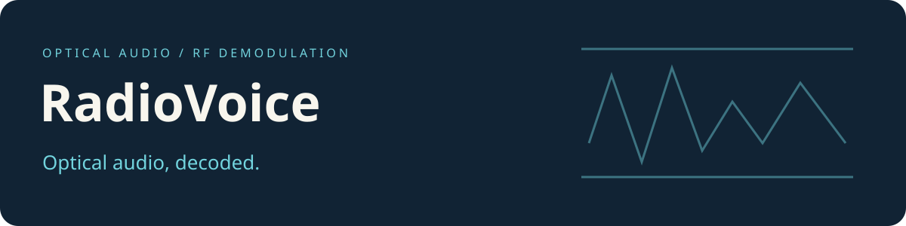

# RadioVoice

**Development history:** Developed locally before publication. These repositories were uploaded together, so their GitHub publication dates do not indicate when development began.

GNU Radio flowgraphs for RF-modulated optical audio and recorded-signal demodulation.

## Choose a flowgraph

| Entry point | Companion graph |
| --- | --- |
| `laser_mf_demod.py` | `laser_mf_demod.grc` |
| `laser_zmod.py` | `laser_zmod.grc` |
| `saleae_demod.py` | `saleae_demod.grc` |
| `usrp_laser_demod2.py` | `usrp_laser_demod2.grc` |

The Python files are generated GNU Radio applications. Open a `.grc` file in GNU Radio Companion to inspect its sources, filters and sinks before running it. Device addresses, sample rates, paths and signal connections retain their existing values.

## Environment

The generated files target GNU Radio 3.10.10.0 and use Qt. Individual graphs also import SDR-specific modules such as `osmosdr`. Hardware sources need compatible devices and drivers; recorded-data sources need their expected input files. This repository does not bundle a runnable Python environment.

[Preservation and verification](COMPATIBILITY.md) records the offline checks and their limits.

## Source terms

New repository presentation and documentation are under [MIT](LICENSE-MIT). The generated Python flowgraphs retain their existing [GPL-3.0 terms](LICENSE-GPL-3.0) and SPDX notices. GNU Radio and device modules retain their separate terms.
